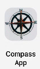

# 📍 Compass App

Welcome to the Compass App! This application is built using Kotlin and utilizes inbuilt sensors to provide accurate directional information. It was developed following a tutorial video available [here](https://youtu.be/t8EyCcyf704?si=9ZFh9G01LfOb_7pR).

## 🛠️ Features

- 📐 Accurate Directional Readings: Uses your device's built-in sensors to give precise compass readings.
- 📱 User-Friendly Interface: Easy to use with a clean and intuitive design.
- 🔄 Real-Time Updates: Directional information updates in real-time as you move.

## 🚀 Getting Started

To get started with the Compass App, follow these steps:

1. **Clone the repository:**
   ```bash
   git clone https://github.com/yourusername/compass-app.git
2. Open the project in Android Studio:
   Ensure you have Android Studio installed.
   Open the project by selecting `File -> Open` and navigate to the project directory.
3. Build and run the app:
   Connect your Android device or use an emulator.
   Click the 'Run' button or use the shortcut `Shift + F10`.

📸 Screenshots




📚 Tutorial Reference

This app was developed following the tutorial by [Scaler](https://youtu.be/t8EyCcyf704?si=9ZFh9G01LfOb_7pR). A big thanks to them for their comprehensive guide!

🧑‍💻 Contributing

Contributions are welcome! If you have any ideas or improvements, feel free to submit a pull request or open an issue.
